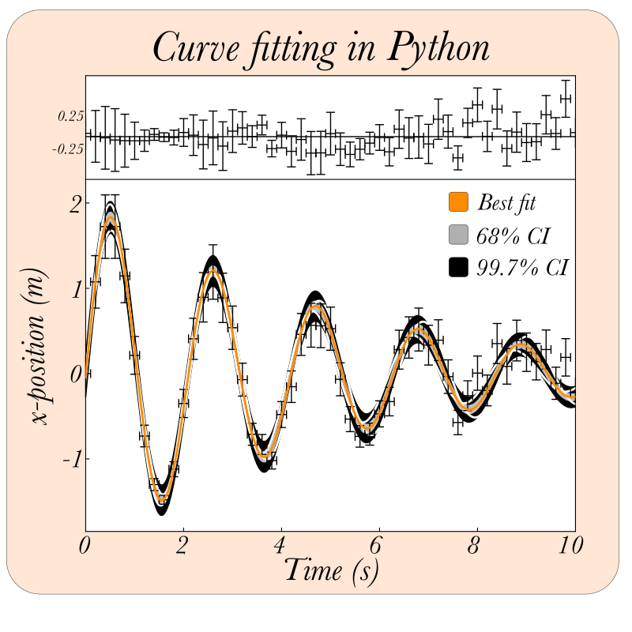

# Project Curve_fit versus Lmfit

 

In this project I will compare two different methods to apply a fit to a dataset. The first method uses scipy.curve_fit() function. Manually I calculate the $\chi^2$. The second method is to use lm-fit package.

